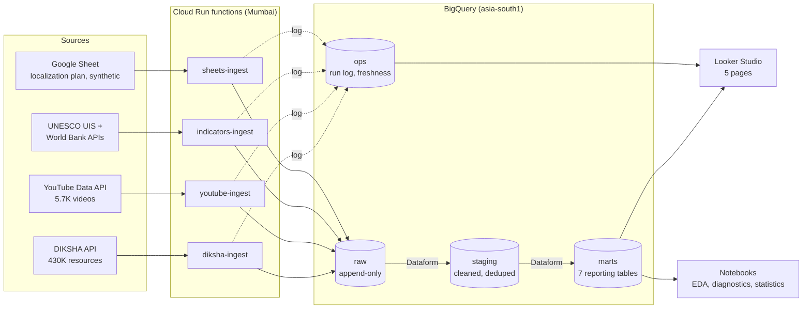
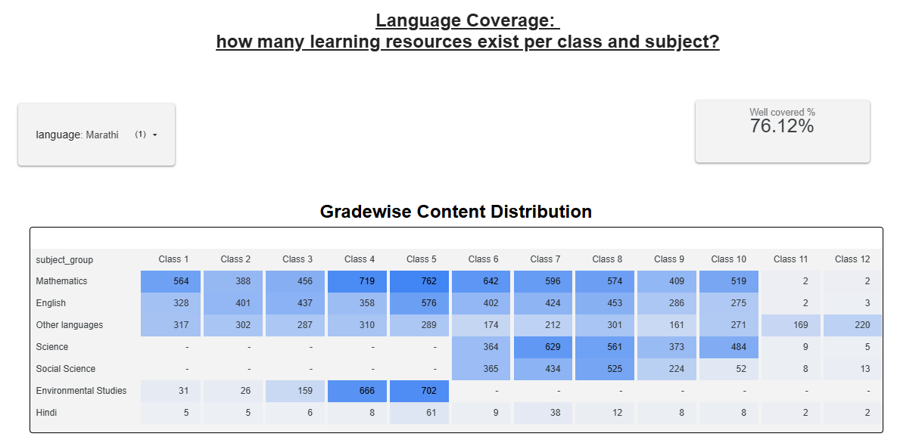
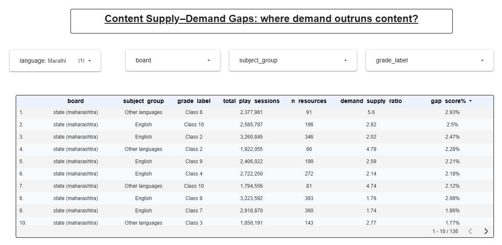
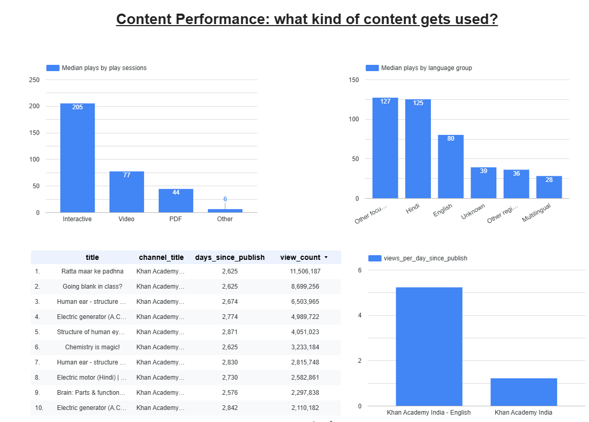
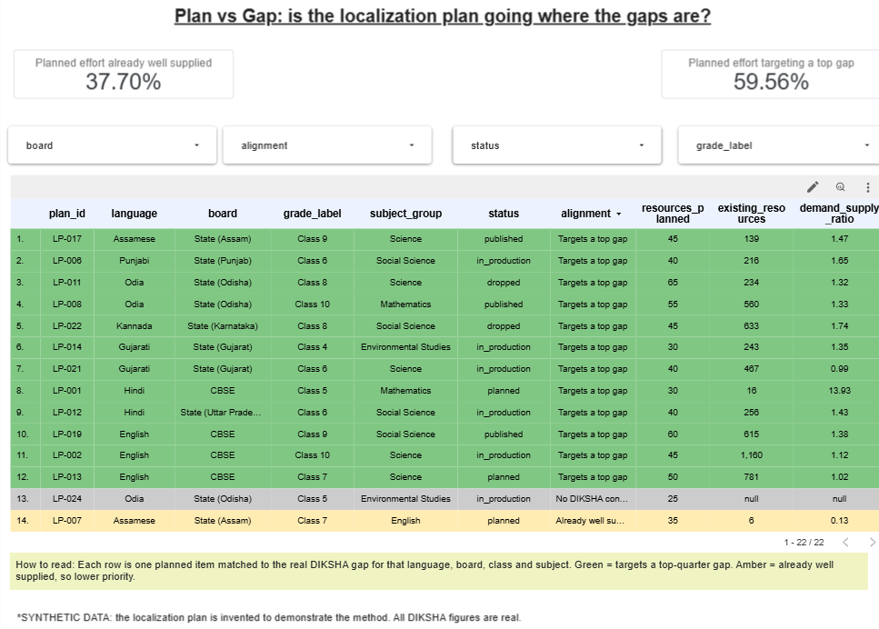
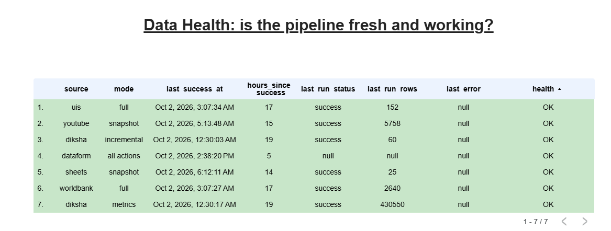
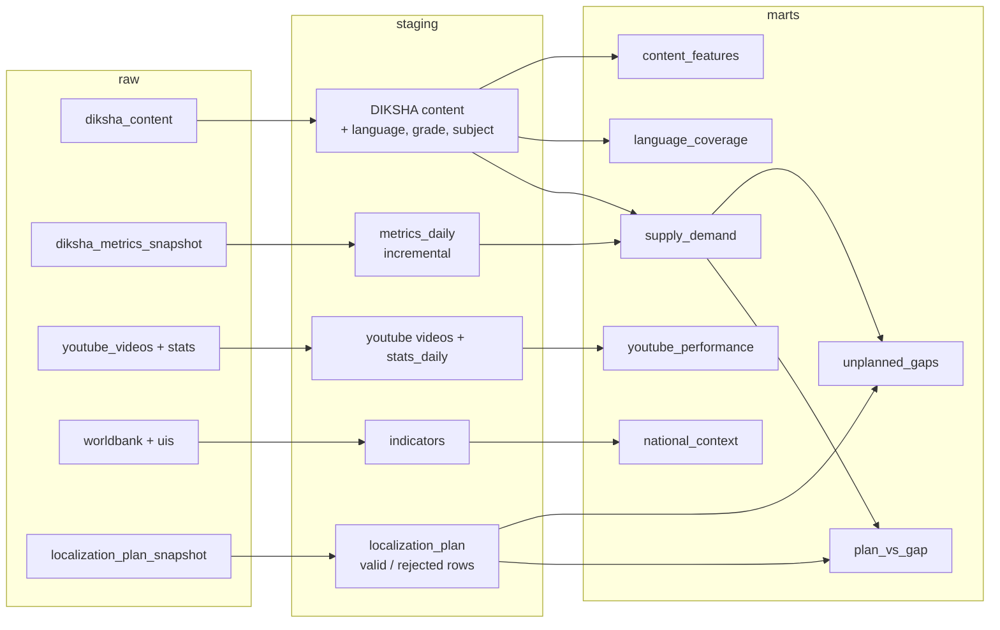

# learning-content-pulse

**Where are Indian-language learners underserved, and what kind of content gets used?**

An automated GCP pipeline that loads public Indian school-content data into BigQuery, models it with SQL, and answers that question with analysis and a Looker Studio dashboard. It refreshes itself every morning.

> *Not affiliated with DIKSHA, YouTube or Khan Academy. Uses public data only. The localization plan is **synthetic** (invented to demonstrate the method); every DIKSHA, YouTube and indicator figure is real.*

**Dashboard:** `<add Looker Studio link>` · **Findings memo:** [reports/insights_memo.md](reports/insights_memo.md)

---

## The story in one picture



**Daily run (IST):** 06:00 Cloud Scheduler `diksha-daily` → 06:30 `youtube-daily` → 07:00 Dataform `daily-all` (staging, marts, assertions, freshness check). World Bank / UIS and the Google Sheet are loaded on demand.

## What it found

| # | Finding |
|---|---|
| 1 | Gaps are specific: Kannada primary Maths (Classes 1–5) has demand up to **13×** supply; Punjabi English (Classes 6–11) has only 10–16 resources per class. |
| 2 | Only **63%** of Assamese class × subject cells have 10+ resources, against 100% for Hindi and English. |
| 3 | Holding grade, subject, format, board and age equal, local-language content gets about **2×** the plays of English, and interactive content **+47%** over PDF. |
| 4 | The top **1%** of resources get **54%** of all plays. |
| 5 | In the synthetic plan, about **38%** of planned effort goes to cells that are already well supplied. |

Full write-up with recommendations and caveats: [reports/insights_memo.md](reports/insights_memo.md). Findings are associations from observational data, not causes.

## Dashboard

| Page | Question it answers | Built from |
|---|---|---|
| Language Coverage | How complete is each language, by class and subject? | `marts.mart_language_coverage` |
| Supply–Demand Gaps | Where does demand most exceed supply? | `marts.mart_supply_demand` |
| Content Performance | What kind of content gets used? | `marts.mart_content_features`, `mart_youtube_performance` |
| Plan vs Gap | Is the localization plan going where the gaps are? | `marts.mart_plan_vs_gap`, `mart_unplanned_gaps` |
| Data Health | Is the pipeline fresh and working? | `ops.v_freshness`, `v_run_history` |

**1. Language Coverage** (Marathi shown)



**2. Supply–Demand Gaps** (Marathi shown)



**3. Content Performance**



**4. Plan vs Gap** (synthetic localization plan)



**5. Data Health**



## Repository layout

```
functions/      Cloud Run ingestion functions (diksha, youtube, indicators, sheets)
dataform/       SQLX models: staging, marts, ops views, assertions
infra/bigquery/ DDL for the raw and ops tables
analysis/       Notebooks: 01_eda, 02_diagnostics, 03_statistics
reports/        Insights memo
docs/           Data dictionary, ingestion design and test log
scripts/        API smoke test, notebook generators
reference/      Synthetic localization-plan seed (with answer key)
tests/          pytest suite on saved fixtures, no live network calls
```

## Design highlights

- **One function per source**, each idempotent, with exponential backoff, a `--dry-run` mode, and a row in `ops.ingestion_log` for every run, including failures.
- **DIKSHA's 10,000-result paging cap** is handled by splitting loads into date-range slices of at most 9,000 items.
- **Append-only raw layer**, with the latest row per resource chosen in staging.
- **Daily usage snapshots**, because the API only gives running totals and history can't be fetched later.
- **Data quality as code:** Dataform assertions on keys, language mapping, plan-sheet reject rate and source freshness. A failed assertion fails the 07:00 run.
- **Real-data messiness handled on purpose:** language lives in `medium` (the `language` field is 98% "English"), multi-class tags are curriculum-checked, and a first-draft gap formula was replaced after checking real rows.

Details and every API test: [docs/ingestion_design.md](docs/ingestion_design.md). Column definitions: [docs/data_dictionary.md](docs/data_dictionary.md). Decision records: [docs/decisions/](docs/decisions/).

## ELT in Dataform

Simplified lineage (the full graph has 10 staging tables, 7 marts, 3 ops views and 4 assertions):



Assertions run with the workflow and fail the 07:00 run on a duplicate or null key, an unmapped language, a high sheet reject rate, or a stale source. Models live in [dataform/definitions/](dataform/definitions/).

## How to run it

**Tests** (fixtures only, no network):

```bash
pip install -e ".[dev]"
python -m pytest -q
```

**Smoke test the public APIs** from a machine in India:

```bash
python scripts/check_apis.py
```

**Deploy (summary).** Everything was set up through the Cloud Console. In your own project:
1. Create BigQuery datasets `raw`, `staging`, `marts`, `ops` in `asia-south1`, then run the DDL in `infra/bigquery/`.
2. Create the service accounts `ingestion-sa` and `dataform-sa` with least-privilege roles (see [docs/ingestion_design.md](docs/ingestion_design.md)).
3. Deploy each `functions/<name>/main.py` as a Cloud Run function (Python 3.12, entry point `run`). Store the YouTube key in Secret Manager.
4. Add the two Cloud Scheduler jobs, import `dataform/` into a Dataform repository, and schedule the workflow.
5. Run `diksha-ingest` once with `{"mode": "full"}`, then the daily jobs take over.

Sheet for the localization plan: import `reference/localization_plan_seed.csv` into a Google Sheet and share it with `ingestion-sa` as Viewer.

## Limits and caveats

- Usage is DIKSHA **web-portal plays only**, and about 82% of student resources report any.
- Daily usage history starts on **1 Oct 2026**, so trends need a few weeks.
- Resources DIKSHA deletes or unpublishes are not detected (no weekly full reload, by choice).
- A resource tagged for several classes or subjects counts in each.
- The localization plan is synthetic.
